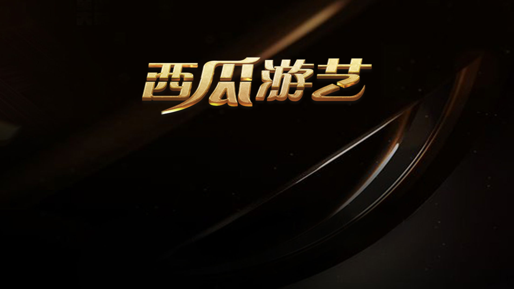

西瓜游艺-龙虎益智游戏为单机游戏，简单又益智，风趣又有味。
玩家与系统1对1对战，其他玩家不能参与。开局随机玩家或者系统先行翻牌，翻到的颜色决定双方控制的棋子的颜色。每个玩家每回合控制一颗棋子，只能移动一个格子。棋子大小顺序：龙>象>虎>豹>狼>狗>猫>鼠，鼠能吃龙；同样棋子相碰两者同归于尽。一方棋子被全部吃掉时，直接判负。双方连续30步没有吃子则自动判和棋。最后双方如果都只剩下一枚棋子时，棋子大的直接获胜，如果双方棋子一样则为平局。

联系电话: +8615202452955

联系邮箱: desentech@qq.com